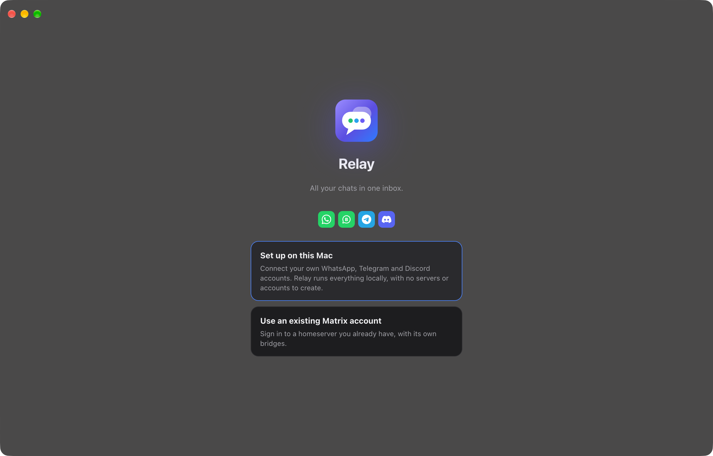

# Relay



One inbox on your Mac for WhatsApp (and WhatsApp Business), Telegram, Signal, Discord,
Instagram, Messenger, Google Messages, Slack, LinkedIn, X, Bluesky and Google Voice.

Relay works the way Beeper does, but **everything runs on your Mac**. It sets up its own small
Matrix server and the open-source [mautrix](https://docs.mau.fi/bridges/) bridges locally. There's
no cloud, no account to create and nothing passes through anyone else's servers. Each network sees
Relay as a normal linked device, like WhatsApp Web.

```
 WhatsApp ─┐
 Telegram ─┼─ mautrix bridges ── Synapse (127.0.0.1) ── Relay (Electron + React)
 Signal ───┘        all on your Mac
```

> Relay is an independent project. It isn't affiliated with Beeper, Automattic, Meta or any of the
> networks it connects to.

## Features

- Unified inbox with each network's logo on every chat, profiles rail per account, People / Groups / Unread filters
- Several accounts per network (for example a personal and a Business WhatsApp)
- Chats you archived or pinned on your phone are archived or pinned here too
- Replies (double-click or swipe), threads, reactions, edits, deletes, forwarding, multi-select
- Media with a preview tray and caption before sending, files up to 2 GB; drop files on any chat in the list
- Updates itself from GitHub releases (Settings → About)
- Voice messages with waveform, playback speed, a mini player and local transcription
  (via [whisper.cpp](https://github.com/ggml-org/whisper.cpp), if installed)
- Read receipts with "Seen at" times, typing indicators, mentions
- Labels, starred messages, mute, disappearing-message timer, notes
- Native notifications, Dock badge, sounds with their own volume controls, light and dark mode
- End-to-end encryption via the Rust crypto SDK; session stored in the macOS Keychain

## Install

Download the `.dmg` from [Releases](../../releases), drag Relay to Applications, then open it.

The build isn't notarized by Apple, so the first time macOS will refuse to open it. Either
right-click Relay in Applications → **Open**, or run:

```bash
xattr -dr com.apple.quarantine /Applications/Relay.app
```

**Requirements:** an Apple silicon Mac and Python 3.10+ (`brew install python`). No Docker.
Optional: `brew install ffmpeg` (voice messages in the native format) and `brew install whisper-cpp`
plus a `ggml` model (voice transcription).

## How local mode works

Choose **Set up on this Mac** on the first screen. Relay then:

1. installs its own private Matrix server (Synapse, in a Python virtualenv),
2. downloads the official bridges from GitHub and checks their checksums (WhatsApp, Telegram and
   Discord at first; others when you add that network),
3. runs them in the background, listening on `127.0.0.1` only.

Add accounts with the **+** button in the sidebar. Everything lives in
`~/Library/Application Support/Relay/local`, with logs in `logs/` there.

Notes:
- **Mac must be on.** Messages flow while the Mac is awake and Relay is running (the window can be
  closed), and catch up when it wakes. Turn on **Settings → Open Relay when I log in**.
- **Telegram** needs a free API key from my.telegram.org; Relay walks you through it.
- **Discord, Instagram, Messenger, X, LinkedIn:** connecting a personal account through an unofficial
  client can break those services' terms. Bans are rare, but possible.
- **Not available:** LINE, Viber and Tumblr (no public bridge), Google Chat (its bridge is
  unmaintained) and iMessage (not done yet).
- **WhatsApp bridge patch.** If Go is installed, Relay builds a slightly patched WhatsApp bridge
  (`resources/whatsapp-sync-login.patch`) that resyncs contact names and photos per account.

## Sound packs

The built-in sounds are generated by `scripts/make-sounds.mjs`. To use your own, put files in
`~/Library/Application Support/Relay/sounds`:

- `interface/sound_<name>.wav` replaces a built-in sound (`send`, `receive`, `push`, `react_like`,
  `react_heart`, `react_haha`, `react_emphasize`, `react_question`, `react_dislike`).
  `receive` is also the default notification sound.
- every file in `notifications/` (`.wav`, `.m4a`, `.mp3`) shows up as a notification sound choice.

## Develop

```bash
npm install
npm run dev        # Vite + Electron with hot reload
npm start          # production build, then launch
npm run dist       # Relay.app + .dmg in ./release, signed with your own certificate if you have one
npm run dist:public  # ad-hoc signed build, for sharing
npm run release    # dist:public + a GitHub release with the .dmg and the .zip the updater uses
```

You can also sign in with any existing Matrix account that has bridges (see
[docs/SELF_HOSTING.md](docs/SELF_HOSTING.md)). `scripts/dev-server.sh` starts a throwaway Synapse
in Docker filled with fake bridged chats, for UI work without real accounts.

| Path | What it does |
| --- | --- |
| `electron/main.cjs` | Window, Keychain session storage, media auth, notifications, voice tools |
| `electron/local.cjs` | Local mode: installs and supervises Synapse and the bridges |
| `electron/preload.cjs` | The small bridge (`window.relay`) between the UI and the main process |
| `src/matrix.js` | Login, client start-up, crypto and recovery key, message helpers |
| `src/networks.js` | Detects each room's network |
| `src/components/` | Inbox, chat list, chat view, composer, settings, onboarding |
| `resources/libolm.3.dylib` | Needed by the bridges; rebuild with `scripts/build-libolm.sh` |

## License

MIT, see [LICENSE](LICENSE). The bridges Relay downloads are separate programs under their own
licenses (mostly AGPL-3.0), and `resources/whatsapp-sync-login.patch` is a patch to
mautrix-whatsapp under AGPL-3.0. Network names and logos belong to their owners.
